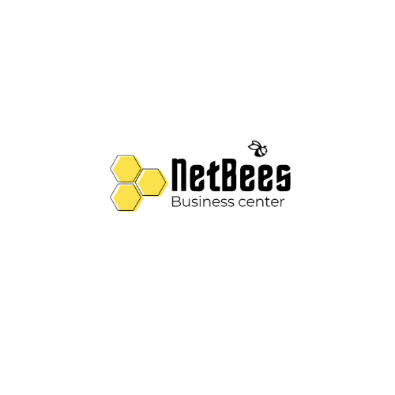

# 📂 Proyecto NetBees

  
  <h2> Bienvenido a NetBees</h2>

📌 **Selecciona una categoría para explorar:**

<table>
  <tr>
    <td align="center">
      <a href="https://github.com/usuario/repositorio/tree/main/diagrams">
         
        📊 <strong>Diagramas UML</strong>
      </a>
    </td>
    <td align="center">
      <a href="https://github.com/usuario/repositorio/tree/main/docs">
         
        📄 <strong>Documentación</strong>
      </a>
    </td>
    <td align="center">
      <a href="https://github.com/usuario/repositorio/tree/main/code">
         
        💻 <strong>Código Fuente</strong>
      </a>
    </td>
  </tr>
</table>

