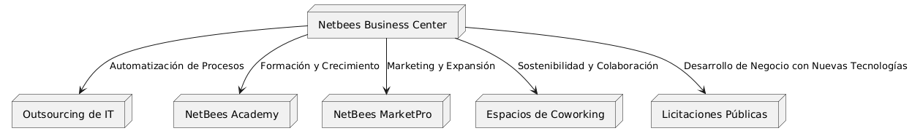
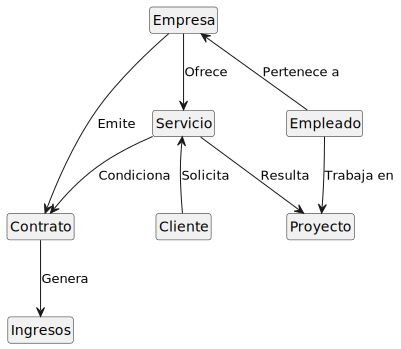

# 🏭 NetBees | Transformando la Industria en Cantabria

🌟 **Bienvenido a NetBees**  
NetBees es el área inteligente del **Polígono Industrial de Guarnizo**, un **centro de innovación, colaboración y desarrollo** que impulsa a las empresas locales hacia la Industria 4.0. Desde la automatización hasta el marketing digital con IA, ayudamos a transformar negocios con tecnología.

---

## 🌍 **Visión**
Convertir NetBees y su ecosistema en el **epicentro de la transformación digital industrial en Cantabria**, optimizando procesos, aumentando la competitividad de las empresas y fomentando la sostenibilidad.

## 🌍 **Misión**
Fomentar un ecosistema de innovación en Cantabria que atraiga talento digital global y potencie el crecimiento económico a través de servicios especializados en tecnología, automatización y transformación digital. NetBees Business Center busca ser un punto de referencia para empresas y emprendedores, facilitando su crecimiento mediante innovación, colaboración y desarrollo.

## 🎯 **Objetivos**
✅ Digitalizar procesos industriales con IA y automatización.  
✅ Crear un **entorno de colaboración** con networking y formación.  
✅ Potenciar el **desarrollo empresarial** con estrategias de marketing y licitaciones.  
✅ Impulsar la sostenibilidad.

---

## 🚀 **¿Cómo lo hacemos?**

---
## Modelo del Dominio

**Diagrama de Clases**

**Diagrama de Relaciones**

---
## 🔍 DAFO de NetBees

| **Fortalezas** | **Debilidades** |
|---------------|----------------|
| 🚀 Centro de innovación en Cantabria con foco en digitalización y automatización industrial. | 📌 Reconocimiento de marca en desarrollo dentro del sector industrial. |
| 🏢 Infraestructura moderna con tecnología avanzada, formación en IA y estrategias de negocio. | 🎯 Captación de talento digital debido a la preferencia por ciudades con mayor infraestructura tecnológica. |
| 🤝 Red de contactos estratégicos para conectar empresas con inversores y expertos. | ⚠️ Necesidad de reforzar la diferenciación frente a otros actores del sector. |
| 📈 Diversificación de servicios en automatización, marketing digital con IA, formación y asesoramiento. | |

| **Oportunidades** | **Amenazas** |
|------------------|-------------|
| 📊 Crecimiento de la digitalización y necesidad de transformación en empresas tradicionales. | 🏢 Competencia con otros hubs y espacios de innovación que pueden atraer talento y empresas. |
| 🏛 Interés público y privado en la innovación con oportunidades de financiación y alianzas. | 🏡 Impacto del teletrabajo en la demanda de espacios físicos y networking presencial. |
| 🧠 Formación en IA y automatización como servicio clave en la adaptación empresarial. | 💰 Dependencia de subvenciones públicas, cuya disponibilidad puede verse afectada. |
| 📣 Expansión de NetBees MarketPro, apoyando empresas con IA en marketing y licitaciones. | 📜 Regulaciones y cambios normativos que pueden influir en la operatividad del negocio. |

